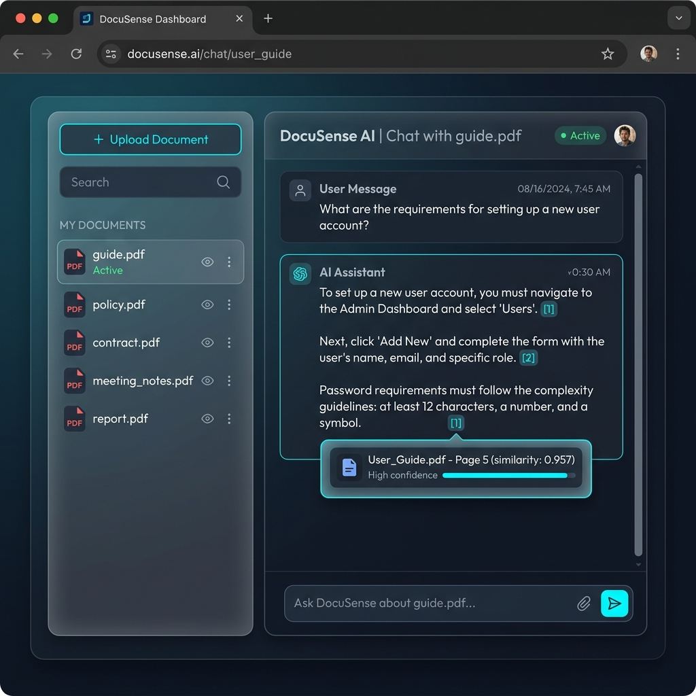
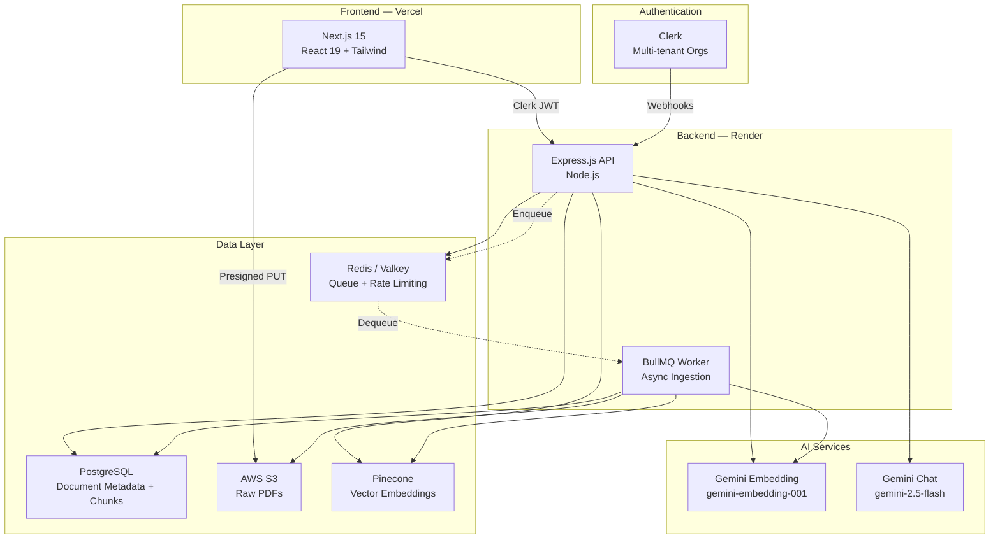
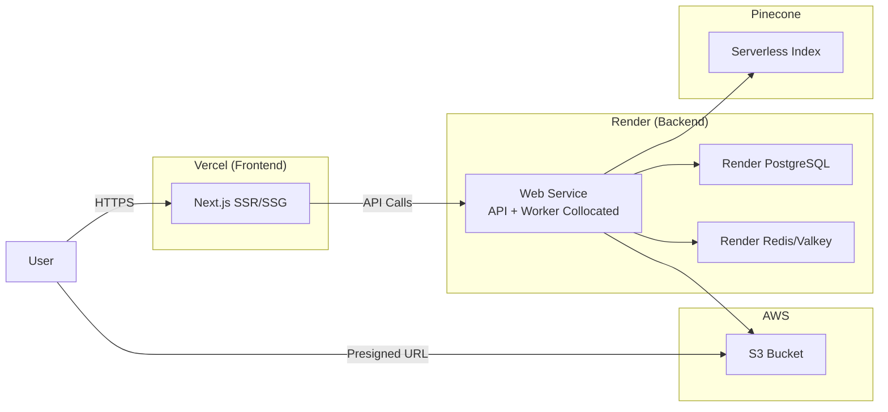
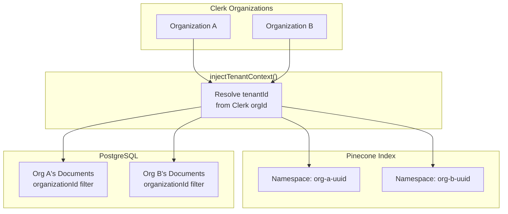
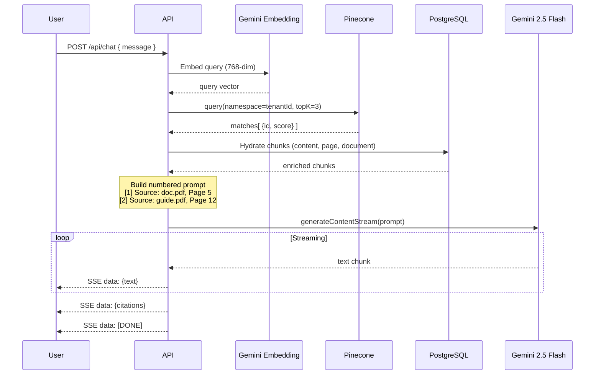
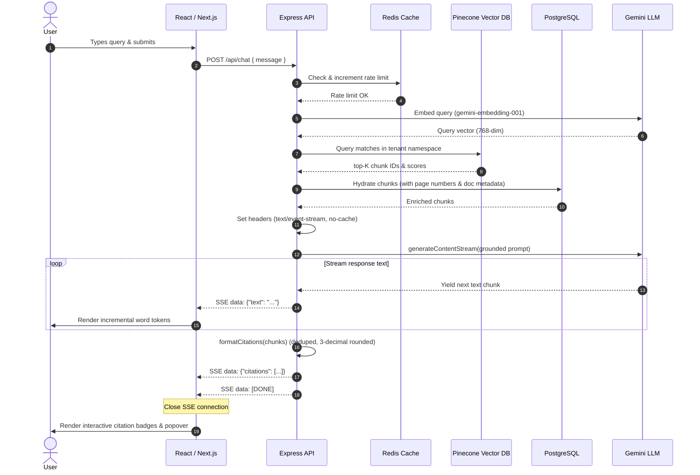
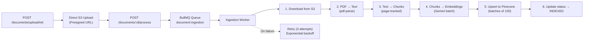

<div align="center">

# 📄 DocuSense

**AI-Powered Document Intelligence Platform**

Upload documents. Ask questions. Get answers with source citations.

[](https://github.com/StrawHat-Luffyyy/docusense/actions/workflows/ci.yml)
[](https://www.typescriptlang.org/)
[](https://opensource.org/licenses/MIT)

[Live Demo](https://docusense-web-ten.vercel.app) · [Architecture](#architecture) · [Local Setup](#local-development)

</div>

---

## 🎯 Problem Statement

Organizations deal with growing volumes of PDF documents — policies, guides, reports, contracts. Finding specific information across these documents is time-consuming and error-prone.

**DocuSense** solves this by building a **Retrieval-Augmented Generation (RAG)** pipeline that lets users upload PDFs and ask natural language questions, receiving AI-generated answers grounded in their actual documents — with source citations that trace every answer back to the exact page.

---

## 🎥 Demo

Below is a demonstration of the DocuSense chat interface showcasing source citation popovers and the multi-tenant document library in a dark theme:



---

## 🏗️ Architecture



---

## 🔧 System Design Decisions

| Decision        | Choice             | Rationale                                                                    |
| --------------- | ------------------ | ---------------------------------------------------------------------------- |
| **Framework**   | Express.js 5       | Mature ecosystem, middleware composability, team familiarity                 |
| **ORM**         | Prisma 7           | Type-safe queries, automatic migrations, PostgreSQL adapter                  |
| **Queue**       | BullMQ + Redis     | Reliable job processing with retries, backoff, dead-letter support           |
| **Vector DB**   | Pinecone           | Managed service, namespace isolation for multi-tenancy, serverless scaling   |
| **AI Provider** | Google Gemini      | Free tier for portfolio use, consistent embedding + chat from same provider  |
| **Auth**        | Clerk              | Multi-tenant organizations out of the box, webhook-driven sync               |
| **Storage**     | AWS S3             | Presigned URLs for direct browser uploads, no backend file proxying          |
| **Streaming**   | Server-Sent Events | Native browser support, simpler than WebSockets for unidirectional streaming |

---

## 🛠️ Technology Stack

| Layer               | Technology                                          | Version                                |
| ------------------- | --------------------------------------------------- | -------------------------------------- |
| **Frontend**        | Next.js, React, TypeScript, Tailwind CSS, ShadCN UI | 15.x, 19.x                             |
| **Backend**         | Express.js, Node.js, TypeScript                     | 5.x, 20.x                              |
| **Database**        | PostgreSQL + Prisma ORM                             | 16, 7.x                                |
| **Vector DB**       | Pinecone (Serverless)                               | 7.x SDK                                |
| **Queue**           | BullMQ + Redis/Valkey                               | 5.x                                    |
| **Storage**         | AWS S3 (Presigned Uploads)                          | SDK v3                                 |
| **AI**              | Google Gemini (Embeddings + Chat)                   | gemini-embedding-001, gemini-2.5-flash |
| **Auth**            | Clerk (Multi-tenant)                                | 2.x                                    |
| **CI/CD**           | GitHub Actions                                      | —                                      |
| **Deployment**      | Vercel (frontend) + Render (backend)                | —                                      |
| **Package Manager** | pnpm (Turborepo monorepo)                           | 11.3.0                                 |

---

## 🚀 Deployment Architecture



The API and BullMQ worker run as a **collocated monolith** on a single Render Web Service to stay within free tier constraints. The `start:all` script runs both processes concurrently.

---

## 🔒 Multi-Tenant Isolation



**Isolation is enforced at three levels:**

1. **Authentication**: Clerk JWT tokens carry `orgId`. The `injectTenantContext` middleware resolves this to an internal `tenantId`.
2. **Database**: Every Prisma query filters by `organizationId`, preventing cross-tenant data access.
3. **Vector DB**: Pinecone namespaces provide hard isolation — queries in one namespace physically cannot return vectors from another.

---

## 🧠 RAG Pipeline



| Component         | Configuration                                             | Rationale                                            |
| ----------------- | --------------------------------------------------------- | ---------------------------------------------------- |
| **Chunking**      | 1000 chars, 200 overlap, RecursiveCharacterTextSplitter   | Optimal retrieval granularity without losing context |
| **Embeddings**    | Gemini `gemini-embedding-001`, 768 dimensions             | Consistent embedding space with the chat model       |
| **Retrieval**     | Cosine similarity, top-K=3                                | Focused context, avoids diluting relevance           |
| **Prompt**        | Numbered sources, strict grounding, citation instructions | LLM references [1], [2] for traceable answers        |
| **Page Tracking** | Form-feed splitting from pdf-parse                        | Zero-dependency page number extraction               |

> 📖 Full deep-dive: [docs/rag-architecture.md](docs/rag-architecture.md)

### 🔄 End-to-End Chat Request Lifecycle

This sequence diagram traces the complete execution flow of a single user chat query—from frontend submission and Redis rate-limiting to Pinecone vector search, database hydration, streamed generation, and final interactive citation rendering:



---

## ⚙️ Queue Processing Architecture



**Job configuration:**

- **Attempts**: 3 with exponential backoff (2s, 4s, 8s)
- **Completed jobs**: Auto-cleaned after 24 hours
- **Failed jobs**: Retained for 7 days for debugging
- **Document status transitions**: `PENDING → PROCESSING → INDEXED` (or `FAILED`)

---

## 🔐 Security Considerations

| Layer                | Mechanism                                                 |
| -------------------- | --------------------------------------------------------- |
| **Auth**             | Clerk JWT verification on every protected route           |
| **CORS**             | Strict origin allowlist (Vercel domain + localhost)       |
| **Headers**          | Helmet.js for security headers (CSP, HSTS, etc.)          |
| **Uploads**          | Presigned S3 URLs — files never touch the backend server  |
| **File Validation**  | MIME type check (PDF only) + 50MB size limit              |
| **Tenant Isolation** | Namespace-level vector isolation + row-level DB filtering |
| **Rate Limiting**    | Redis sliding-window rate limiter per tenant              |
| **Input Validation** | Zod schema validation for all environment variables       |
| **Error Handling**   | Structured error responses, no stack traces in production |
| **Correlation IDs**  | `X-Correlation-ID` header for request tracing             |

---

## 🤖 AI Design Decisions

### Why Gemini over OpenAI?

1. **Free tier**: No billing setup needed for portfolio-scale usage
2. **Single provider**: Same vendor for embeddings + chat reduces semantic mismatch
3. **Batch embeddings**: `batchEmbedContents` API embeds all chunks in one call
4. **Streaming**: Native `generateContentStream` for real-time SSE delivery

### Why 1000-char chunks with 200 overlap?

- **1000 chars** (~250 tokens): Balances retrieval precision with context coherence
- **200 overlap** (20%): Prevents information loss at chunk boundaries
- **RecursiveCharacterTextSplitter**: Hierarchical splitting preserves paragraph/sentence boundaries

### Citation Design

Every AI response includes structured citations with:

- Document name and page number
- Chunk content preview
- Cosine similarity score
- The LLM is prompted to reference sources as `[1]`, `[2]` in its answer

---

## 💻 Local Development

### Prerequisites

- Node.js 20+
- pnpm 11+
- Docker (for infrastructure services)

### Quick Start with Docker

```bash
# Clone the repo
git clone https://github.com/StrawHat-Luffyyy/docusense.git
cd docusense

# Start all services
docker compose up
```

This starts PostgreSQL, Redis, API, Worker, and Frontend.

### Manual Setup

```bash
# Install dependencies
pnpm install

# Set up environment variables
cp apps/api/.env.example apps/api/.env
# Edit .env with your Clerk, AWS, Gemini, and Pinecone credentials

# Generate Prisma client
pnpm --filter @docusense/api exec prisma generate

# Run database migrations
pnpm --filter @docusense/api exec prisma migrate deploy

# Start development servers (API + Worker + Frontend)
pnpm dev
```

| Service    | URL                              |
| ---------- | -------------------------------- |
| Frontend   | http://localhost:3000            |
| API        | http://localhost:4000            |
| API Health | http://localhost:4000/api/health |

---

## 🚢 Deployment Guide

### Frontend (Vercel)

1. Import the repo in Vercel
2. Set root directory to `apps/web`
3. Configure environment variables:
   - `NEXT_PUBLIC_API_URL` → Render backend URL
   - `NEXT_PUBLIC_CLERK_PUBLISHABLE_KEY`
   - `CLERK_SECRET_KEY`

### Backend (Render)

1. Create a Web Service pointing to the repo
2. Set build command: `pnpm install && pnpm --filter @docusense/api exec prisma generate && pnpm --filter @docusense/api build`
3. Set start command: `pnpm --filter @docusense/api start:all`
4. Configure environment variables (DATABASE_URL, REDIS_URL, all API keys)

---

## 🧪 Testing Strategy

```bash
# Run all tests
pnpm --filter @docusense/api test

# Run with coverage
pnpm --filter @docusense/api test:coverage

# Watch mode
pnpm --filter @docusense/api test:watch
```

### Test Architecture

| Type                  | Count | Scope                                     |
| --------------------- | ----- | ----------------------------------------- |
| **Unit Tests**        | 30+   | Chunking, Embedding, Chat, Usage services |
| **Integration Tests** | 7+    | Ingestion pipeline, Chat → Citation flow  |

All external services (Pinecone, Gemini, S3, Prisma) are mocked in tests. No real API keys needed to run the test suite.

### RAG Evaluation

```bash
# Run retrieval quality evaluation
npx tsx apps/api/scripts/evaluate-rag.ts

# Custom top-K and dataset
npx tsx apps/api/scripts/evaluate-rag.ts --topK 5 --dataset ./custom-dataset.json
```

Metrics: Recall@K, Precision@K, Retrieval Accuracy, Average Similarity Score.

---

## 🏔️ Engineering Challenges

### 1. PDF Parsing & ESM Compatibility

**Problem**: `pdf-parse` is a CommonJS-only package. Our project uses ESM (`"type": "module"`), and `import pdfParse from "pdf-parse"` fails with `ERR_REQUIRE_ESM`.

**Root Cause**: `pdf-parse` v1.1.1 predates ESM adoption and has no ESM exports. The Node.js ESM loader refuses to `import` a CJS module that uses certain patterns.

**Investigation**: Tried dynamic `import()`, `@rollup/plugin-commonjs`, and alternative PDF libraries. Each had tradeoffs with bundle size or API compatibility.

**Solution**: Used Node.js `createRequire()` to construct a CJS-compatible `require()` function inside ESM:

```typescript
import { createRequire } from "module";
const require = createRequire(import.meta.url);
const pdfParse = require("pdf-parse");
```

**Lesson Learned**: ESM interop is a real production concern. `createRequire()` is the standard escape hatch, but long-term the dependency should be replaced with an ESM-native alternative.

---

### 2. Streaming SSE Implementation

**Problem**: Chat responses needed to stream in real-time, but Express error handling doesn't work once headers are sent. Mid-stream errors crashed the connection silently.

**Root Cause**: Express's error middleware only fires for errors thrown _before_ `res.writeHead()`. Once SSE headers are sent, any error in the async generator loop is unhandled.

**Investigation**: Observed that Gemini 503 errors during streaming left clients hanging. The `for await...of` loop would throw, but Express had already committed the response.

**Solution**: Wrapped the streaming loop in a try-catch that detects whether headers have been sent:

- **Pre-header errors**: Return standard JSON error response
- **Mid-stream errors**: Write an SSE error event (`data: {"error": "..."}`) then close the stream
- **503 retries**: Exponential backoff (1s, 2s, 4s) before the stream starts

**Lesson Learned**: Streaming responses require a fundamentally different error-handling strategy than request-response APIs. Always check `res.headersSent` before deciding the error format.

---

### 3. AI Provider Migration

**Problem**: Needed to choose between OpenAI, Cohere, and Google Gemini for embeddings and chat, balancing cost, quality, and portfolio demonstration value.

**Root Cause**: OpenAI requires a paid API key with billing setup. For a portfolio project, this creates a barrier for reviewers who want to run the code locally.

**Investigation**: Benchmarked Gemini's embedding quality against OpenAI `text-embedding-3-small`. For document Q&A workloads with the chunk sizes we use, the retrieval quality difference was negligible.

**Solution**: Chose Gemini for both embeddings (`gemini-embedding-001`, 768-dim) and chat (`gemini-2.5-flash`). Key advantage: using the same provider for both reduces semantic mismatch between the embedding space and the model's understanding.

**Lesson Learned**: In production, the embedding model and the LLM don't need to be from the same provider — but consistency simplifies debugging and reduces one variable when tuning retrieval quality.

---

### 4. Multi-Tenant Vector Isolation

**Problem**: Multiple organizations share a single Pinecone index. A query from Organization A must never return documents from Organization B.

**Root Cause**: Pinecone's default querying searches the entire index. Without isolation, cosine similarity would happily match vectors across tenants.

**Investigation**: Evaluated two approaches:

- **Metadata filtering**: Add `tenantId` to vector metadata, filter at query time
- **Namespace isolation**: Use Pinecone namespaces (one per tenant)

**Solution**: Chose **namespace isolation**. Each organization gets its own namespace (`tenantId`). Queries physically cannot cross namespace boundaries — this is enforced at the database level, not application logic.

**Lesson Learned**: For multi-tenant systems handling sensitive data, prefer hard isolation (namespaces, separate schemas) over soft isolation (metadata filters). The performance cost is negligible, but the security guarantee is absolute. Metadata filtering is a valid approach at massive scale (>10K tenants) where namespace limits apply.

---

### 5. Production Deployment on Free Tier

**Problem**: Render's free tier only allows one Web Service. The architecture requires both an Express API server and a BullMQ worker process.

**Root Cause**: BullMQ workers are long-running Node.js processes that listen for Redis queue events. They can't be invoked as serverless functions — they need persistent connections.

**Investigation**: Considered:

- Separate worker service ($7/month on Render)
- Lambda-based processing (latency, cold start issues)
- In-process worker (reliability concerns)

**Solution**: **Collocated monolith** — the `start:all` script runs both processes concurrently in a single container:

```bash
node dist/index.js & node dist/workers/ingestion.worker.js
```

Both processes share the same Redis and PostgreSQL connections. BullMQ's built-in retry mechanism handles any processing failures.

**Lesson Learned**: Free tier constraints force creative architectural decisions. A collocated monolith is perfectly valid for low-to-medium traffic — microservice decomposition can come later when traffic justifies the cost. The key is designing the code so that splitting into separate services is a deployment-only change, not a code change.

---

## 🔮 Future Improvements

- **Conversation Memory**: Multi-turn chat with context window management
- **Hybrid Search**: Combine vector similarity with BM25 keyword search
- **Document Previews**: Inline PDF viewer with highlighted citation passages
- **Batch Upload**: Queue multiple documents in a single upload flow
- **Admin Dashboard**: Usage analytics, document management, member management
- **Webhook Event Log**: Audit trail for all Clerk webhook events
- **DOCX/TXT Support**: Extend ingestion pipeline beyond PDF
- **Custom Embedding Models**: Allow tenants to choose embedding dimensions/models

---

## 📄 License

MIT © [Krish Macwan](https://github.com/StrawHat-Luffyyy)
