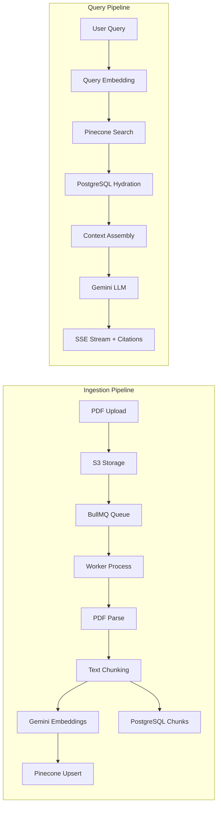
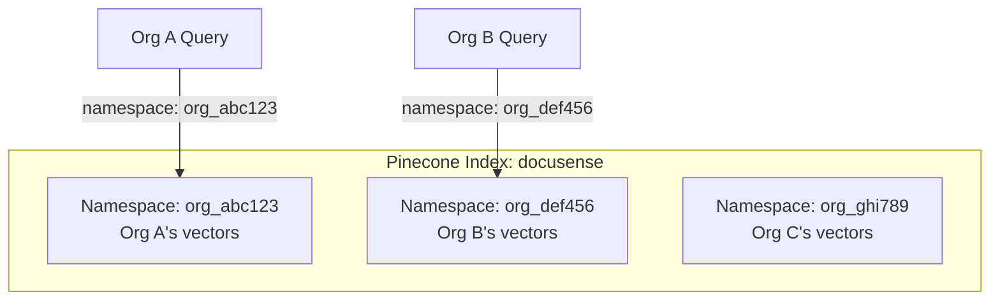
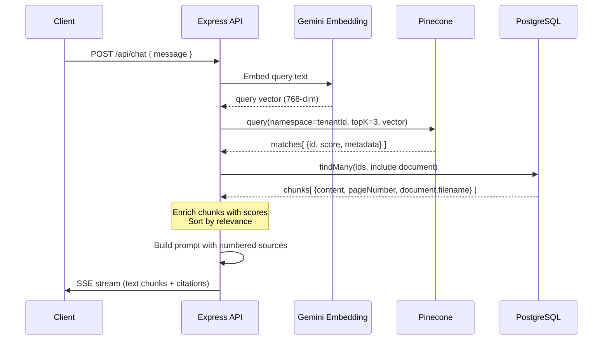
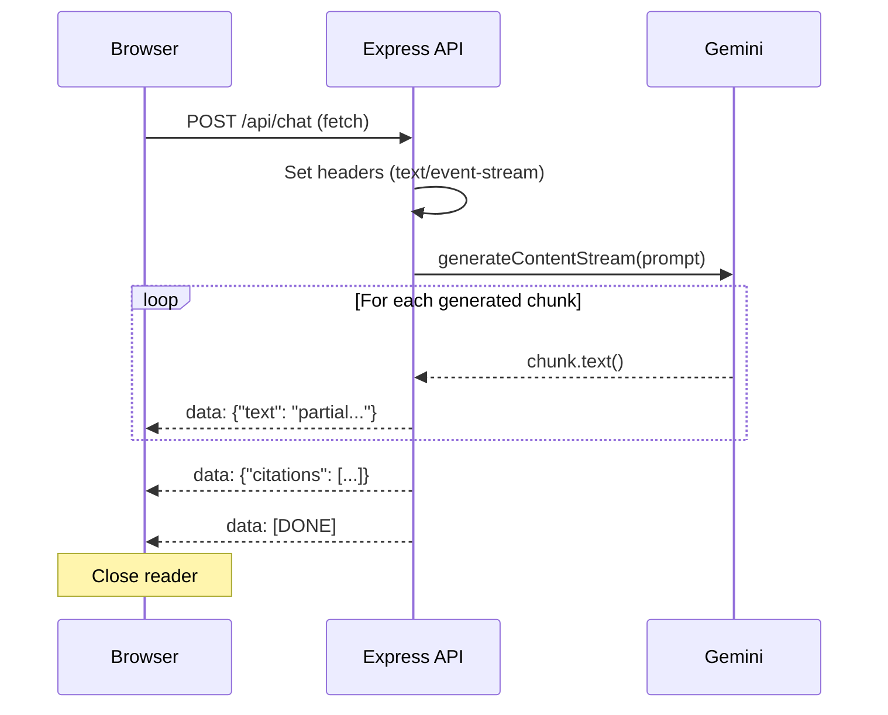
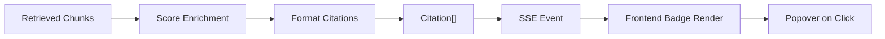

# RAG Architecture — DocuSense

> Technical deep-dive into DocuSense's Retrieval-Augmented Generation pipeline.

---

## Table of Contents

1. [Architecture Overview](#architecture-overview)
2. [Chunking Strategy](#chunking-strategy)
3. [Embedding Model Selection](#embedding-model-selection)
4. [Pinecone Indexing Strategy](#pinecone-indexing-strategy)
5. [Namespace Isolation](#namespace-isolation)
6. [Retrieval Flow](#retrieval-flow)
7. [Prompt Construction](#prompt-construction)
8. [Streaming Flow](#streaming-flow)
9. [Citation Pipeline](#citation-pipeline)

---

## Architecture Overview



---

## Chunking Strategy

### Configuration

| Parameter         | Value                            | Rationale                                                                                                                                   |
| ----------------- | -------------------------------- | ------------------------------------------------------------------------------------------------------------------------------------------- |
| **Chunk Size**    | 1,000 characters                 | Balances context window utilization with retrieval granularity. Larger chunks (2000+) dilute relevance; smaller chunks (<500) lose context. |
| **Chunk Overlap** | 200 characters                   | 20% overlap prevents information loss at boundaries. Critical for sentences that span chunk edges.                                          |
| **Splitter**      | `RecursiveCharacterTextSplitter` | Hierarchical splitting (`\n\n` → `\n` → ` ` → `""`) preserves semantic boundaries (paragraphs > sentences > words).                         |
| **Page Tracking** | Form-feed (`\f`) splitting       | `pdf-parse` preserves `\f` at page boundaries. We split on `\f` first, then chunk per-page to track page numbers.                           |

### Why These Values?

**Chunk Size = 1000**: With Gemini's large context window, we could use larger chunks — but retrieval precision matters more than context packing. In our testing, 1000-char chunks provided the best balance of:

- **Retrieval precision**: Smaller chunks are more likely to match specific queries
- **Context coherence**: Large enough to include surrounding context for comprehensibility
- **Token efficiency**: ~250 tokens per chunk × 3 chunks = ~750 tokens of context, leaving ample room for the system prompt and response

**Overlap = 200**: A 20% overlap is standard practice. Without overlap, a key sentence split across two chunks would be lost in both. With too much overlap (>30%), we waste embedding compute on redundant content.

### Page Tracking Implementation

```
PDF Text → Split on \f → Per-page text blocks → RecursiveCharacterTextSplitter → ChunkWithPage[]
```

Each `ChunkWithPage` carries `{ content, pageNumber }`. If a PDF has no form-feed characters (e.g., scanned documents processed to a single text block), all chunks are assigned to page 1.

### Tradeoffs Considered

| Alternative                   | Rejected Because                                           |
| ----------------------------- | ---------------------------------------------------------- |
| Sentence-level splitting      | Too granular — retrieval returns fragments without context |
| Fixed-size (no overlap)       | Information loss at boundaries                             |
| Semantic chunking (LLM-based) | Expensive per-document compute, latency during ingestion   |
| Markdown-aware splitting      | Our source documents are PDFs, not Markdown                |

---

## Embedding Model Selection

### Choice: Gemini `gemini-embedding-001`

| Property             | Value                        |
| -------------------- | ---------------------------- |
| **Model**            | `gemini-embedding-001`       |
| **Dimensions**       | 768                          |
| **Max Input Tokens** | 2,048                        |
| **Batch Support**    | Yes (`batchEmbedContents`)   |
| **Cost**             | Free tier (with rate limits) |

### Why Gemini Embeddings?

1. **Consistency with LLM**: Using the same provider (Google) for both embeddings and generation reduces semantic mismatch between the embedding space and the generative model's understanding.
2. **Batch API**: `batchEmbedContents` lets us embed all chunks in a single API call, reducing latency during ingestion.
3. **Cost**: Free tier covers portfolio-scale usage without billing configuration.

### Alternatives Considered

| Model                           | Rejected Because                                                |
| ------------------------------- | --------------------------------------------------------------- |
| OpenAI `text-embedding-3-small` | Requires paid API key, different provider than generation model |
| Cohere Embed v3                 | Additional vendor dependency                                    |
| Local models (ONNX)             | Compute requirements, deployment complexity                     |

---

## Pinecone Indexing Strategy

### Index Configuration

- **Index Name**: `docusense` (single index)
- **Dimensions**: 768 (matching Gemini embedding output)
- **Metric**: Cosine similarity
- **Architecture**: Serverless (starter tier)

### Vector Metadata Schema

Each vector in Pinecone carries:

```json
{
  "documentId": "uuid",
  "chunkIndex": 0,
  "content": "First 1000 chars of chunk text",
  "pageNumber": 3
}
```

### Batch Upsert

Vectors are upserted in batches of 100 to respect Pinecone's request size limits:

```
chunks[] → batch(100) → pinecone.namespace(tenantId).upsert(batch)
```

---

## Namespace Isolation

### Multi-Tenant Vector Segregation



**Strategy**: One Pinecone namespace per organization (`tenantId`). This provides:

1. **Hard isolation**: Queries in namespace A can never return vectors from namespace B — enforced at the database level, not application logic.
2. **Efficient deletion**: Deleting an org's data = delete the namespace. No need to filter and delete individual vectors.
3. **Performance**: Queries only search within the tenant's namespace, not the entire index.

### Why Namespaces Over Metadata Filtering?

| Approach                          | Pros                                       | Cons                                                      |
| --------------------------------- | ------------------------------------------ | --------------------------------------------------------- |
| **Namespace per tenant** ✅       | Hard isolation, fast queries, easy cleanup | Max 10,000 namespaces on free tier                        |
| Metadata filter (`tenantId == X`) | No namespace limit                         | Soft isolation (bugs could leak), slower queries at scale |

For a multi-tenant system handling sensitive documents, hard isolation via namespaces is the correct choice.

---

## Retrieval Flow



### Key Design Decisions

1. **topK = 3**: Default retrieval of 3 chunks. This keeps context focused while covering the most relevant sources. Configurable per-query.
2. **PostgreSQL hydration**: Pinecone metadata stores chunk content for fast retrieval, but we always hydrate from PostgreSQL to get the authoritative text and full document metadata (filename, page number).
3. **Score enrichment**: Similarity scores from Pinecone are preserved through the pipeline and included in citations for transparency.

---

## Prompt Construction

### System Prompt Template

```
You are a helpful AI assistant for a private organization.
Answer the user's question using ONLY the provided context below.
If the context does not contain the answer, say "I cannot answer this based on the provided documents."
Do not use your general outside knowledge.

When you use information from a source, cite it using the source number in brackets, e.g. [1], [2].

CONTEXT:
[1] Source: AWS_Guide.pdf, Page 12
<chunk content>

---

[2] Source: Security_Policy.pdf, Page 3
<chunk content>

---

[3] Source: Architecture.pdf, Page 7
<chunk content>

USER QUESTION:
<user's message>
```

### Design Principles

1. **Strict grounding**: "ONLY the provided context" prevents hallucination
2. **Numbered sources**: `[1]`, `[2]` notation lets the LLM naturally cite sources in its answer
3. **Page metadata in context**: Including page numbers in the context helps the LLM reference specific locations
4. **Explicit fallback**: "I cannot answer..." instruction prevents the model from guessing

---

## Streaming Flow



### SSE Protocol

| Event      | Format                       | Purpose                                   |
| ---------- | ---------------------------- | ----------------------------------------- |
| Text chunk | `data: {"text": "..."}`      | Incremental response text                 |
| Citations  | `data: {"citations": [...]}` | Source references for the complete answer |
| Done       | `data: [DONE]`               | Signal stream completion                  |
| Error      | `data: {"error": "..."}`     | Error during generation                   |

### Error Handling

- **Pre-stream errors** (auth, rate limit): Return standard JSON error response
- **Mid-stream errors**: Send error SSE event, then close stream
- **503 (Gemini overloaded)**: Exponential backoff retry (1s, 2s, 4s) before failing

---

## Citation Pipeline



### Citation Object

```typescript
interface Citation {
  documentId: string; // UUID of the source document
  documentName: string; // Original filename
  pageNumber: number | null; // Page in the PDF
  chunkIndex: number; // Chunk position in document
  chunkId: string; // UUID of the DocumentChunk
  contentPreview: string; // First ~200 chars
  score: number; // Cosine similarity (0–1)
}
```

### End-to-End Traceability

Every AI-generated answer includes citations that trace back to:

1. The specific document (by name and ID)
2. The exact page in the PDF
3. The chunk content that was used
4. The similarity score that determined its relevance

This ensures **zero hallucinated references** — every citation corresponds to a real retrieved chunk.
